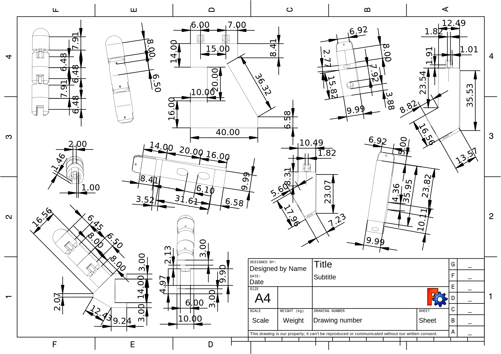

<!-- Improved compatibility of back to top link: See: https://github.com/othneildrew/Best-README-Template/pull/73 -->

<!--
*** Thanks for checking out the Best-README-Template. If you have a suggestion
*** that would make this better, please fork the repo and create a pull request
*** or simply open an issue with the tag "enhancement".
*** Don't forget to give the project a star!
*** Thanks again! Now go create something AMAZING! :D
-->

<!-- PROJECT SHIELDS -->
<!--
*** I'm using markdown "reference style" links for readability.
*** Reference links are enclosed in brackets [ ] instead of parentheses ( ).
*** See the bottom of this document for the declaration of the reference variables
*** for contributors-url, forks-url, etc. This is an optional, concise syntax you may use.
*** https://www.markdownguide.org/basic-syntax/#reference-style-links
-->

# Mecatronica-Proyecto
<!-- [![Contributors][contributors-shield]][contributors-url]
[![Forks][forks-shield]][forks-url]
[![Stargazers][stars-shield]][stars-url]
[![Issues][issues-shield]][issues-url]
[![MIT License][license-shield]][license-url]
[![LinkedIn][linkedin-shield]][linkedin-url]

 -->

<!-- PROJECT LOGO -->
 

  

  <h3 align="center">Proyecto-Zeus.</h3>

  

     
    <a href="https://github.com/RoboTech-URJC/Mano-Zeus.git"><strong>Original Robotech Repo »</strong></a>
     
     
    <a href="https://github.com/othneildrew/Best-README-Template">View Demo</a>
    ·
    <a href="https://github.com/othneildrew/Best-README-Template/issues/new?labels=bug&template=bug-report---.md">Personal Blog</a>
  

## Sesiones 3-4-5 | Diseño 2D.

En estas sesiones nos centramos en el diseño 2D. He aplicado los conocimientos en clase para diseñar un pequeño logo que decore el proyecto.
Requisitos:
* Inkscape.
* Creatividad.

  

A continuacion os dejo un pequeño video de como Marvin ha hecho este pequeño logo sobre el proyecto: 

https://github.com/user-attachments/assets/d4b07c5d-308e-4ce0-a138-df33238a739b

Empleando Inkspace he desarrollado un dibujo de la estructura que debe de tener la mano robótica que vamos a recrear. Es un diseño simple a modo de entendimiento de las diferentes partes que la componen. 

Este es el diseño que hemos obtenido:

  

(<a href="#readme-top">inicio</a>)

