<!-- Improved compatibility of back to top link: See: https://github.com/othneildrew/Best-README-Template/pull/73 -->

<!--
*** Thanks for checking out the Best-README-Template. If you have a suggestion
*** that would make this better, please fork the repo and create a pull request
*** or simply open an issue with the tag "enhancement".
*** Don't forget to give the project a star!
*** Thanks again! Now go create something AMAZING! :D
-->

<!-- PROJECT SHIELDS -->
<!--
*** I'm using markdown "reference style" links for readability.
*** Reference links are enclosed in brackets [ ] instead of parentheses ( ).
*** See the bottom of this document for the declaration of the reference variables
*** for contributors-url, forks-url, etc. This is an optional, concise syntax you may use.
*** https://www.markdownguide.org/basic-syntax/#reference-style-links
-->

# Mecatronica-Proyecto
<!-- [![Contributors][contributors-shield]][contributors-url]
[![Forks][forks-shield]][forks-url]
[![Stargazers][stars-shield]][stars-url]
[![Issues][issues-shield]][issues-url]
[![MIT License][license-shield]][license-url]
[![LinkedIn][linkedin-shield]][linkedin-url]

 -->

<!-- PROJECT LOGO -->
 

  

  <h3 align="center">Proyecto-Zeus.</h3>

  

     
    <a href="https://github.com/RoboTech-URJC/Mano-Zeus.git"><strong>Original Robotech Repo »</strong></a>
     
     
    <a href="https://github.com/othneildrew/Best-README-Template">View Demo</a>
    ·
    <a href="https://github.com/othneildrew/Best-README-Template/issues/new?labels=bug&template=bug-report---.md">Personal Blog</a>
  

---
## **Índice**
1. [Diseño 2D](#id1)
2. [Diseño 3D](#id2)
3. [Diseño Electrónico de la Mano de Zeus](#id3)
4. [Montaje de la Mano de Zeus](#id4)
5. [Código de la Mano de Zeus](#id5)

## Diseño 2D

En estas sesiones nos centramos en el diseño 2D. He aplicado los conocimientos en clase para diseñar un pequeño logo que decore el proyecto.
Requisitos:
* Inkscape.
* Creatividad.

  

A continuacion os dejo un pequeño video de como Marvin ha hecho este pequeño logo sobre el proyecto: 

https://github.com/user-attachments/assets/d4b07c5d-308e-4ce0-a138-df33238a739b

Empleando Inkspace he desarrollado un dibujo de la estructura que debe de tener la mano robótica que vamos a recrear. Es un diseño simple a modo de entendimiento de las diferentes partes que la componen. 

Este es el diseño que hemos obtenido:

  

(<a href="#readme-top">inicio</a>)

En materia del diseño vectorial, también es posible compatibilizarlo con otras técnicas, y para aplicarlo también al proyecto desde otra perspectiva, se me ha ocurrido investigar conversores de gráficos. Existen numerosos convertidores online gratuitos y algunos otros de pago que mejoran los resultados, y esto facilita que ciertas imágenes o diseños puedan ser vectorizados con herramientas también distintas a Inkscape y que no están pensadas en un principio para el diseño vectorial.

Aplicando estas herramientas a nuestro proyecto, Moisés ha diseñado un dibujo simple de algunos componentes de la mano, que también puede servir de apoyo a diagramas explicativos o información que se quiera enseñar y explicar del proyecto:

  
  

De las dos imágenes superiores, la izquierda pertenece a un formato en .png, siendo el fichero de dibujo original. Por otra parte la imagen derecha es el resultado de pasar la anterior por un conversor a svg (formato vectorial). El utlizado en este caso ha sido:
- https://png2svg.com/es/

Dejo a continuación un vídeo del proceso de diseño original de la imagen superior, en un programa de diseño no vectorial:

## **Diseño 3D**

En cuanto al diseño en 3D que hemos implementado en FreeCad ha sido una estructura simple del ejemplo de dibujo en 2D de Inkspace, obteniendo una estructuracompuesta por rectangulos similar a una mano, pero bastante simplificada. Mostrando en ella todos las piezas en las que tenemos pensado estructurarla.

La estructura se encuentra en el siguiente link: [Mano.FCStd](https://github.com/mpancracio2020/Mecatronica-Proyecto/tree/main/images/Mano.FCStd)

Sin embargo, este modelo 3D era una simplificación del modelo real que queríamos crear y estaba bastante lejos de la complejidad del modelo real que utilizamos. Por lo tanto, me propuse simular una versión más realista del modelo impreso utilizando sus dimensiones para crear un modelo 3D más simple que todos puedan usar y modificar según sus necesidades.

Creé este modelo en FreeCAD utilizando la herramienta "Part" para el diseño 3D general y la herramienta "TechDraw" para elaborar el plano y extraer las medidas.

Aquí están algunas imágenes del modelo que desarrollé, el cual es más similar al real y abarca únicamente la parte de la mano, incluyendo los huecos para pasar los hilos y mover los dedos. La muñeca y el antebrazo no están diseñados.

 
   
   

 

 
   
  
   
   

Este es un video del diseño final.

 
   
  

El plano dibujado es el siguiente:

 
   
   

Y el archivo con todo el diseño 3D lo puedes encontrar en [hand.FCStd](https://github.com/mpancracio2020/Mecatronica-Proyecto/tree/main/images/hand.FCStd)

En cuanto al resto de diseño 3D hemos utilizado Ultimaker Cura para diseñar las piezas basandonos en el proyecto original del cual hemos sacado la idea. Hemos modificado los archivos (.lts) de los componentes aportando diferentes valores para obtener la mejor impresión de las piezas en nuestras impresoras 3D.

 

## **Diseño Electrónico de la Mano de Zeus**

### 1. Componentes:
Para crear y diseñar el circuito electronico primero debemos elegir que componentes son necesarios y los más óptimos para el correcto funcionamiento de la mano.

- **Arduino UNO / MEGA:** primero hemos elegido como cerebro de nuestro robot un arduino UNO ya que es suficiente para poder comandar el resto de componentes. Si se llega a aumentar el numero de componentes como el añadir otro brazo, usaremos un arduino Mega para poder tener mas pines a los que conectar todos los componentes.

  <a>
    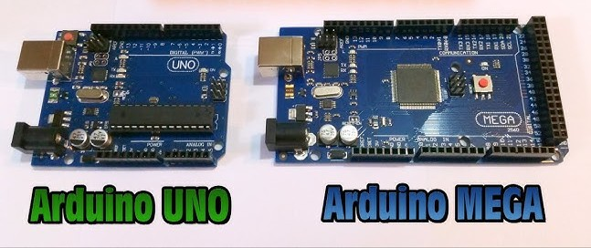
  </a>

- **Servos:** en concreto el modelo tower pro mg996r, un servo de 360 grados el cual nos permite una rotación completa y necesaria para mover los dedos y muñeca los ángulos necesarios. En concreto usaremos 6 servos por cada mano.

  <a>
    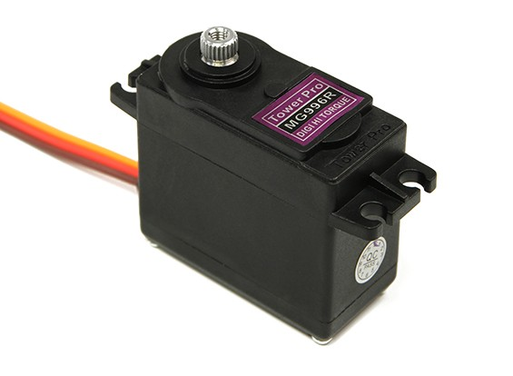
  </a>

- **Protoboard:** la usaremos para tener mejor conectados y controlados todos los componentes.
- **Cables Macho-Macho / Macho-Hembra:** los usaremos para conectar los componentes entre sí.
- **Batería:** la necesitaremos implementar también para poder mover los servos y que estos puedan mover los dedos.

  <a>
    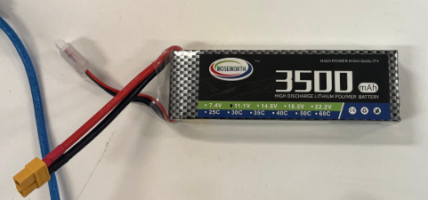
  </a>

### 2. Circuito (Fritzing):
Para poder visualizar de una manera mas simple y rapida sin tener que conectar de forma presencial todo el circuito hemos usado la aplicación Fritzing para poder diseñar el circuito. Esta nos permite añadir los componentes necesarios y los modelos específicos que utilizaremos.

El circuito inicial diseñado es el siguiente:

  <a>
    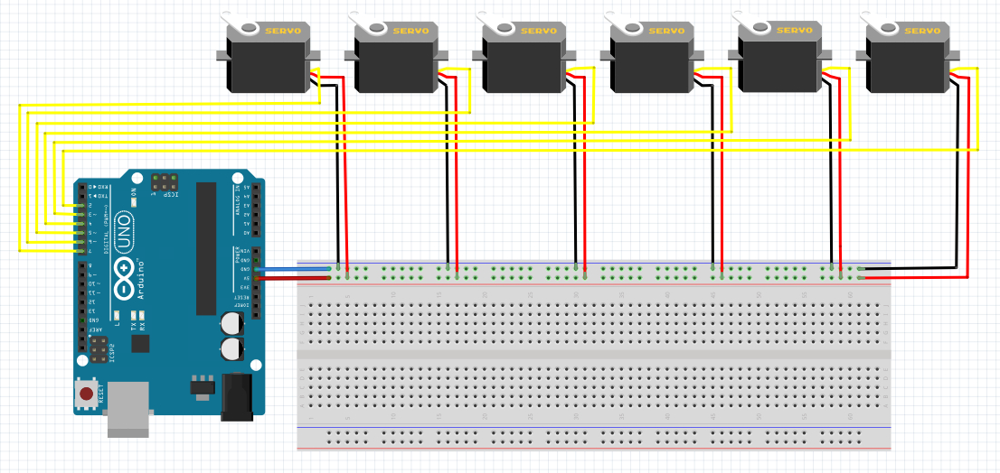
  </a>

Después de probar este circuito nos dimos cuenta de que los servos se movian pero no tenían la fuerza necesaria para poder mover los dedos tirando de los hilos, debido a su peso. Por lo cual se nos ocurrió posteriormente el incluir una batería solo para alimentar a todos los servos. Después de añadirla el circuito diseñado queda de la siguiente forma:

  <a>
    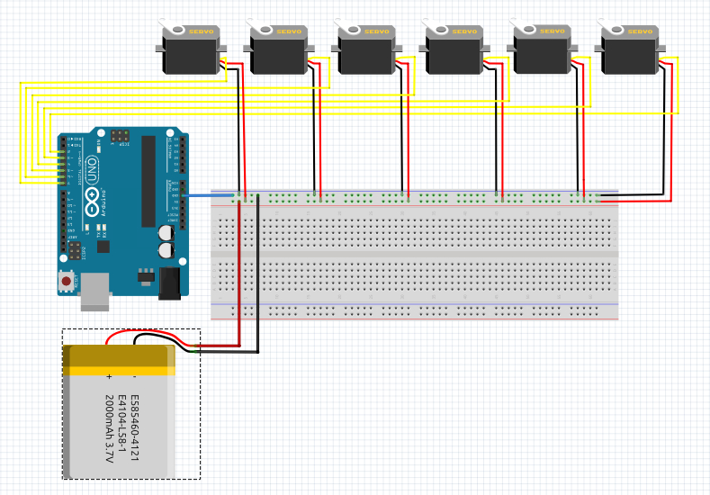
  </a>

 

## Montaje de la Mano de Zeus

### 1. Componentes:

Teniendo el diseño 3d de las piezas, ajustamos adecuadamente los tamaños y utilizamos una impresora 3d para imprimir cada una. En total para la mano derecha desarrollada fueron utilizadas las siguientes partes:
- **Dedo meñique:** conformado por 6 piezas, ensambladas posteriormente entre sí. Adaptado del modelo original: [auriculaire-finger](https://inmoov.fr/inmoov-stl-3d/?bodyparts=Right-Hand&parts=Auriculaire3.stl)
- **Dedo anular:** conformado por 6 piezas, ensambladas posteriormente entre sí. Adaptado del modelo original: [ring-finger](https://inmoov.fr/inmoov-stl-3d/?bodyparts=Right-Hand&parts=ringfinger3.stl)
- **Dedo corazón:** conformado por 6 piezas, ensambladas posteriormente entre sí. Adaptado del modelo original: [majeure-finger](https://inmoov.fr/inmoov-stl-3d/?bodyparts=Right-Hand&parts=Majeure3.stl)
- **Dedo índice:** conformado por 6 piezas, ensambladas posteriormente entre sí. Adaptado del modelo original: [index-finger](https://inmoov.fr/inmoov-stl-3d/?bodyparts=Right-Hand&parts=Index3.stl)
- **Dedo pulgar:** conformado por 6 piezas, ensambladas posteriormente entre sí. Adaptado del modelo original: [thumb-finger](https://inmoov.fr/inmoov-stl-3d/?bodyparts=Right-Hand&parts=thumb5.stl)

  

- **Espaciador:** soporte estructural para ensamblar los dedos meñique y anular con la muñeca corta. Adaptado del modelo original: [bolt-entretoise](https://inmoov.fr/inmoov-stl-3d/?bodyparts=Right-Hand&parts=Bolt_entretoise7.stl)
- **Muñeca larga:** pieza única, ensamblada para conformar el mecanismo del movimiento transferido de muñeca a los dedos, junto con la Muñeca corta. Adaptado del modelo original: [wrist-large](https://inmoov.fr/inmoov-stl-3d/?bodyparts=Right-Hand&parts=WristlargeV4.stl)
- **Muñeca corta:** dos piezas, ensambladas al dedo anular y meñique, uniéndolos a la Muñeca larga para conformar el movimiento transferido por la muñeca a los dedos mencionados. Adaptado del modelo original: [wrist-small](https://inmoov.fr/inmoov-stl-3d/?bodyparts=Right-Hand&parts=WristsmallV4.stl)

  

- **CableHolderWristV5:** elemento de apoyo para facilitar la incorporación del cableado que conecta con muñeca y mano. Adaptado del modelo original: [cable-holder](https://inmoov.fr/inmoov-stl-3d/?bodyparts=Rotation-Wrist&parts=CableHolderWristV5.stl)
- **RotaWrist 3V3:** pieza única relacionada con el módulo de la muñeca. Adaptado del modelo original: [rotawrist3v3](https://inmoov.fr/inmoov-stl-3d/?bodyparts=Rotation-Wrist&parts=RotaWrist3V3.stl)
- **RotaWrist 2V3:** primera de las piezas que conforman la cobertura posterior del módulo de la muñeca. Adaptado del modelo original: [rotawrist2v3](https://inmoov.fr/inmoov-stl-3d/?bodyparts=Rotation-Wrist&parts=RotaWrist2V3.stl)
- **RotaWrist 1V4:** segunda de las piezas que conforman la cobertura posterior del módulo de la muñeca. Adaptado del modelo original: [rotawrist1v4](https://inmoov.fr/inmoov-stl-3d/?bodyparts=Rotation-Wrist&parts=RotaWrist1V4.stl)
- **WristgearsV5:** engranajes necesarios para la rotación del módulo de la muñeca. Adaptado del modelo original: [wrist-gears](https://inmoov.fr/inmoov-stl-3d/?bodyparts=Rotation-Wrist&parts=WristGearsV5.stl)
- **RobocableBackV3:** pieza de apoyo para la integración del cableado, junto con rob-cable-front. Adaptado del modelo original: [rob-cable-back](https://inmoov.fr/inmoov-stl-3d/?bodyparts=Forearm-and-Servo-Bed&parts=RobCableBackV3.stl)
- **RobocableFrontV3v:** segunda pieza de apoyo para la integración del cableado con la rotación de muñeca. Adaptado del modelo original: [rob-cable-front](https://inmoov.fr/inmoov-stl-3d/?bodyparts=Forearm-and-Servo-Bed&parts=RobCableFrontV3.stl)
- **RoboRingV3:** anillos ensamblados a los servomotores, necesarios para implementar el movimiento de los dedos. Adaptado del modelo original: [rob-ring](https://inmoov.fr/inmoov-stl-3d/?bodyparts=Forearm-and-Servo-Bed&parts=RobRingV3.stl&doing_wp_cron=1732996341.5229659080505371093750)
- **RobServoBedV6:** pieza única empleada para situar correctamente la posición interna de los servomotores. Adaptado del modelo original: [servo-bed](https://inmoov.fr/inmoov-stl-3d/?bodyparts=Forearm-and-Servo-Bed&parts=RobServoBedV6.stl)
- **TensionerRightV1:** pieza de apoyo al ensamblaje de los componentes internos. Adaptado del modelo original: [tensioner-right](https://inmoov.fr/inmoov-stl-3d/?bodyparts=Forearm-and-Servo-Bed&parts=TensionerRightV1.stl)
- **Servo-pulley:** poleas circulares, transforman el movimiento de los servomotores. Adaptado del modelo original: [servo-pulley](https://inmoov.fr/inmoov-stl-3d/?bodyparts=Forearm-and-Servo-Bed&parts=servo-pulleyX5.stl)

  
  

- **Cubierta superior (tumbada):** similar a las piezas que cubren los dedos, siendo esta una cobertura para la parte superior de la mano. Adaptado del modelo original: [top-surface](https://inmoov.fr/inmoov-stl-3d/?bodyparts=Right-Hand&parts=topsurfaceUP6.stl&doing_wp_cron=1732995560.7582659721374511718750)
- **Cubrededos:** conformado por 5 piezas, ensambladas sobre los dedos. Adaptado del modelo original: [cover-finger](https://inmoov.fr/inmoov-stl-3d/?bodyparts=Right-Hand&parts=coverfinger1.stl)
- **Soporte Arduino:** pieza única para contener la placa Arduino controladora. Adaptado del modelo original: [arduino-support](https://inmoov.fr/inmoov-stl-3d/?bodyparts=Right-Hand&parts=ardiuinosupport.stl)
- **Robcap3V2:** uno de los componentes que conforman el antebrazo, siendo la cubierta superior del mismo. Adaptado del modelo original: [robcap3v2](https://inmoov.fr/inmoov-stl-3d/?bodyparts=Right-Hand&parts=robcap3V2.stl)
- **Robcap2V4:** primera cubierta anterior del antebrazo. Adaptado del modelo original: [robcap2v4](https://inmoov.fr/inmoov-stl-3d/?bodyparts=Right-Hand&parts=robpart2V4.stl)
- **Robcap3V4:** segunda cubiera anterior del antebrazo. Adaptado del modelo original: [robcap3v4](https://inmoov.fr/inmoov-stl-3d/?bodyparts=Right-Hand&parts=robpart3V4.stl)
- **Robcap4V4:** primera cubierata posterior del antebrazo. Adaptado del modelo original: [robcap4v4](https://inmoov.fr/inmoov-stl-3d/?bodyparts=Right-Hand&parts=robpart4V4.stl)
- **Robcap5V4:** segunda cubierta posterior del antebrazo. Adaptado del modelo original: [robcap5v4](https://inmoov.fr/inmoov-stl-3d/?bodyparts=Right-Hand&parts=robpart5V4.stl)

  

### 2. **Diseño esquemático por componentes**

Para simplificar el montaje, y describir de manera más sencilla la forma en que se realizó, queda a continuación un diagrama dibujado y comentado, con sus elementos explicados en detalle más adelante en este mismo documento:

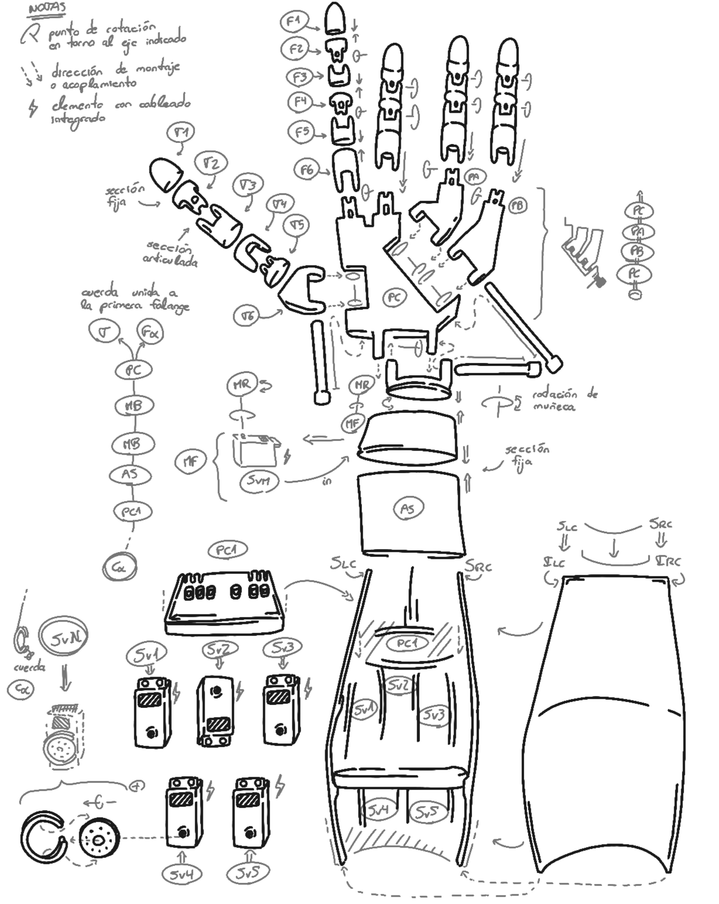

<table>
  <tr>
    <th>F1 - F6</th>
    <td>Falanges de la superior a inferior, de todo dedo salvo el pulgar</th>
  </tr>
  <tr>
    <th>T1 - T6</td>
    <td>Falanges de la superior a inferior, del dedo pulgar</td>
  </tr>
  <tr>
    <th>PA</td>
    <td>Pieza intermedia entre la parte central de la mano y el dedo anular. Esta pieza rota en torno a un tornillo que la encaja</td>
  </tr>
  <tr>
    <th>PB</td>
    <td>Pieza intermedia entre la parte central de la mano y el dedo meñique. Esta pieza rota en torno a un tornillo que la encaja</td>
  </tr>
  <tr>
    <th>PC</td>
    <td>Pieza central de la mano sobre la cual se ensamblan los dedos pulgar, índice y corazón, y las piezas intermedias PA y PB</td>
  </tr>
  <tr>
    <th>MR</td>
    <td>Parte rotativa de la muñeca, apoyada sobre la muñeca fija, y ofreciendo movimiento en torno al servomotor interno a la misma</td>
  </tr>
  <tr>
    <th>MF</td>
    <td>Muñeca fija, conjunto de piezas y cobertura que sirven de apoyo a la muñeca rotativa para ejercer su giro</td>
  </tr>
  <tr>
    <th>SVM</td>
    <td>Servomotor de la muñeca. Situado interno a la muñeca fija, y anclado a la rotativa</td>
  </tr>
  <tr>
    <th>AS</td>
    <td>Antebrazo superior. Conjunto de piezas encarcasadas más cortas que el antebrazo posterior, uniendo la muñeca con el mismo</td>
  </tr>
  <tr>
    <th>SLC & SRC</td>
    <td>Esquinas superior izquierda (SLC) y superior derecha (SRC) de la carcasa interna del antebrazo posterior o largo. Deben ir alineadas con ILC e IRC respectivamente</td>
  </tr>
  <tr>
    <th>ILC & IRC</td>
    <td>Esquinas superior izquierda (ILC) y superior derecha (IRC) de la carcasa externa del antebrazo largo. La carcasa de la que forman parte se alinea con la previamente mencionada y la recubre, dando forma al antebrazo</td>
  </tr>
  <tr>
    <th>PC1</td>
    <td>Conjunto de piezas centrales al antebrazo largo, ensambladas sobre la carcasa interna para servir de guía para los cables o fibras que mueven los dedos</td>
  </tr>
  <tr>
    <th>SV1 - SV6</td>
    <td>Servomotores numerados del 1 al 6, Componen el sistema de movimiento de los dedos de la mano, uniéndose a ellos por medio de unas cuerdas (C alpha) ancladas a los servos gracias a unas guías circulares</td>
  </tr>
  <tr>
    <th>SVN</td>
    <td>Abreviatura utilizada para referirse a "cualquier servomotor del antebrazo", pudiendo ser desde SV1 hasta SV6 pero no SVM</td>
  </tr>
  <tr>
    <th>C alpha</td>
    <td>Abreviatura utilizada para referirse a "cualquier cuerda ó fibra encargada de guiar el movimiento de los dedos desde su unión a un servomotor SVN" </td>
  </tr>
</table>

Aunque en el diagrama aparecen indicados también una serie de elementos que forman parte del dibujo, y la guía puede ser de ayuda para entender las abreviaturas, hay algunas cosas más que hay que tener en cuenta relativas al montaje: 
- Cada dedo está dividido en el mismo número de falanges, y cada falange cuenta con uniones tanto fijas como rotativas, indicadas estas últimas con un icono explicativo en la imagen superior.
- Las falanges de los dedos, tanto pulgar como índice, corazón, anular y meñique, cuentan con guías para los cables en las uniones articuladas, y con aberturas en aquellas uniones fijas, para que sea posible la unión entre la parte final de cada dedo y el servomotor que lo controlará.
- Además de los tornillos de ensamblaje que se han dibujado arriba, el montaje requirió de la utilización de otros tornillos metálicos no indicados previamente, así como algunos elementos adicionales para la correcta sujeción de algunas piezas.
- La parte interior del antebrazo largo, así como el antebrazo superior en detalle, que se indican previamente y se encuentran explicados, cuentan con otros elementos internos en su estructura, no mencionados por no ser de especial relevancia para la comprensión del funcionamiento del sistema mecánico que conforma la Mano de Zeus

### 3. Esquematización

Queda a continuación un breve time lapse de la **parte final** del diseño del esquema superior:

### 4. Impresión y ensamblaje

* Primeras impresiones.

A continuación se muestran la imagenes de las primeras impresiones de los ficheros stl que nos proporciona el proyecto original.

  <a>
    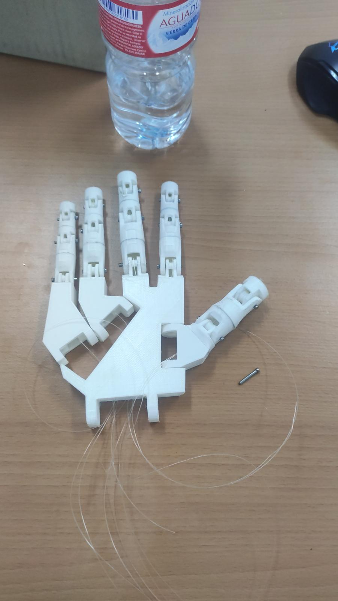
  </a>
 <a>
    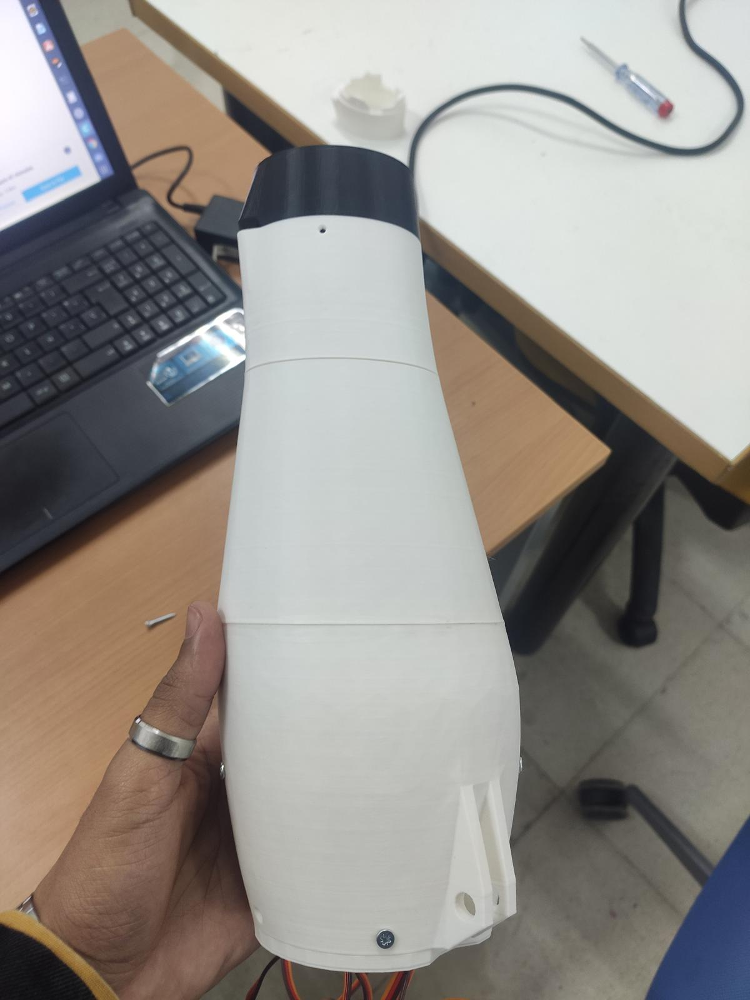
  </a>
 <a>
    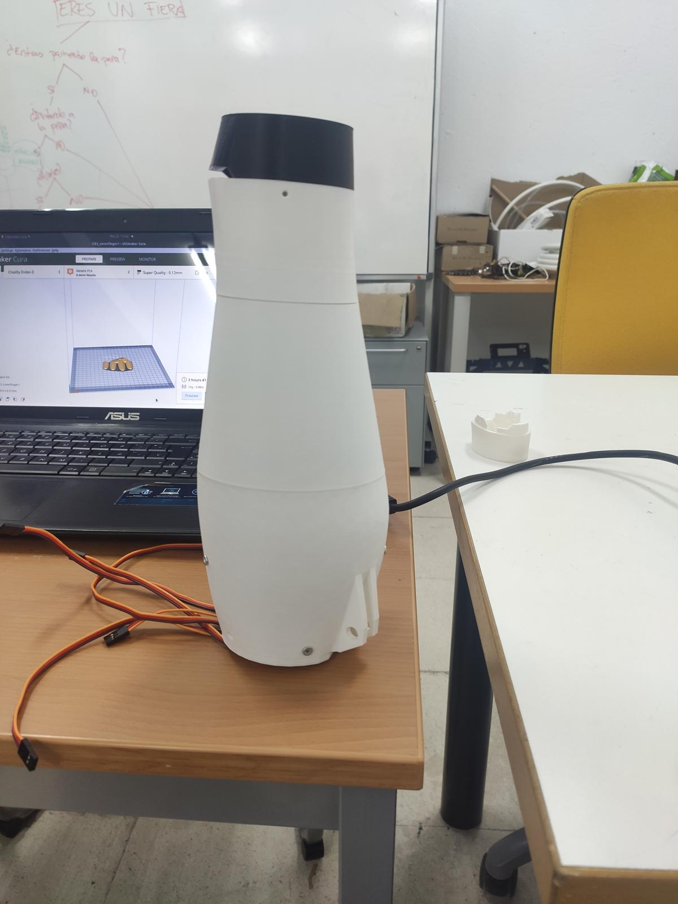
  </a>
 <a>
    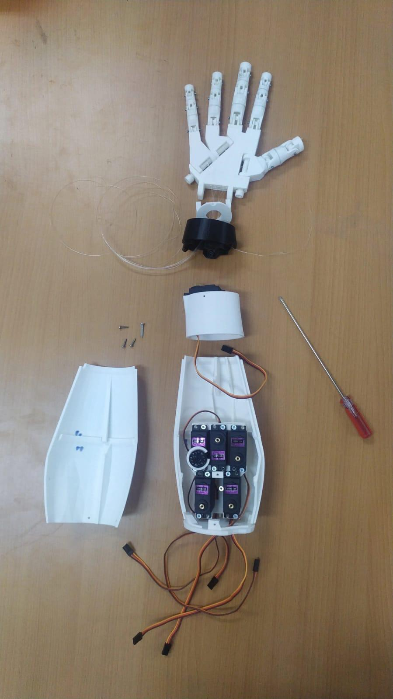
  </a>
  <a>
    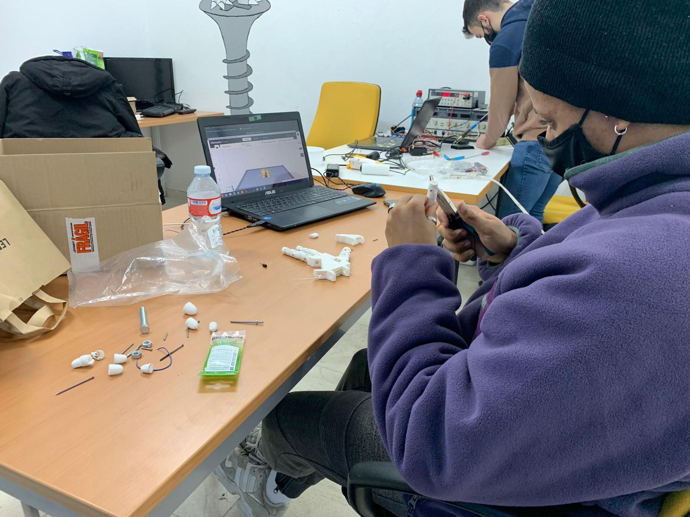
  </a>
  <a>
    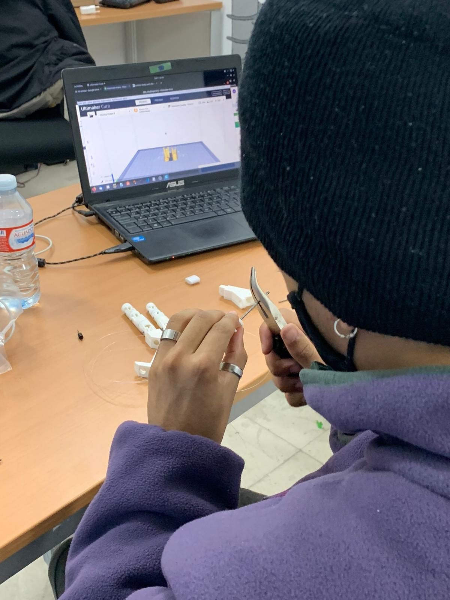
  </a>

La totalidad de las impresiones de han hecho en una impresora <a href="https://www.creality.com/es/products/ender-3-3d-printer"><strong>Creality Ender 3 »</strong></a>

* Problemas y dificultades.

El mayor problema de todos a la hora de montar las piezas es el material de las mismas, PLA. Esto provocaba que a la hora de encajar o generar una fuerza sobre ellas que no estaba
preparada para soportar, rompiamos la pieza. Han sido varias las piezas que se han vuelto a imprimir debido a roturas. 

Hay que tener en cuenta que hay muchas fricciones y tensiones simultaneas en el mecanismo completo de una sola mano, un total de 6 servos independientes que actuan para cada dedo y muñeca,
que esto funcione acorde es bastante importante, debido a que un minimo error puede provocar las roturas mencionadas anteriormente.

## Soporte para el antebrazo

Como parte adicional a la mano de Zeus en sí, decidimos buscar una manera de mantenerla sujeta sin necesidad de apoyarla directamente sobre la mesa, o de sujetarla para cualquier tipo de demostración y presentación. Esto nos llevó a pensar en un soporte que se adaptase a la forma del antebrazo y nos permitiera mantenerlo en posición horizontal, ya que podría ser algo desarrollado en una sola pieza, y más sencillo que un soporte que la mantuviera en vertical a la hora de hacer el diseño. Además, esta posición también resulta más segura, ya que reduce casi al mínimo la posibilidad de que pudiera caerse el conjunto.

Para el soporte, tomando de base un fichero stl, aplicamos ciertas modificaciones realizadas con blender para adaptarlo a nuestras necesidades de tamaño, número de caras y vértices, forma, etc. Las modificaciones aplicadas fueron realizadas utilizando Blender 2.79b, una versión que inicialmente dificulta la compatibilidad con stl, pero que haciendo uso de dos plugins sirvió para aquello que necesitábamos. Dichos plugins quedan a continuación para su descarga y utilización en esta misma versión o similares:

- [blender2ogre.zip](./add-ons/blender2ogre-0.6.0.zip)
- [ImportExporTL-blender.zip](./add-ons/ImportExportTL_blender25x_v0.6.2.zip)

Cualquiera que quiera replicar la utilización debe descargar los ficheros previos como zip, sin extraer su contenido y añadirlos tal cual en el apartado de *"Add-ons"* dentro de la pestaña de *"User Preferences"* en el editor de Blender. Una vez hecho esto, cualquier problema de compatibilidad con ficheros stl debería quedar resuelto, tanto para importar como para exportar este tipo de ficheros.

### Desarrollo en blender

El desarrollo de nuestra versión final del soporte se hizo aplicando al stl original un ajuste leve en su tamaño, junto a una reducción de la carga de vértices y caras que presentaba la figura original. Finalmente tras dejar una versión final que encajaba con aquello que buscábamos, re-exportamos el trabajo a stl para poder posteriormente tomar las medidas pertinentes en FreeCad del soporte hecho.

  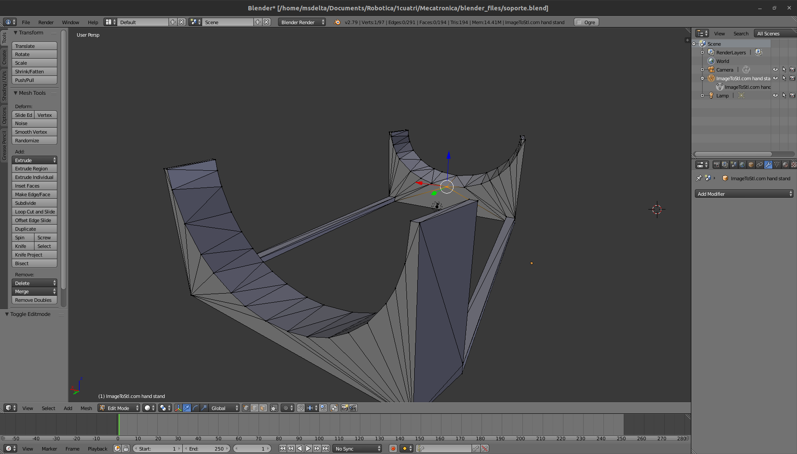
  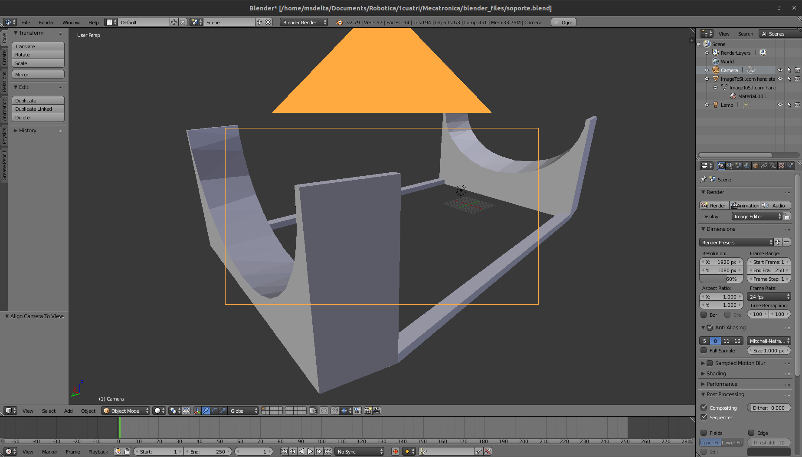

A continuación queda el fichero de blender en su versión final para su copia y libre utilización:

- [Soporte_redu_blend](./models/soporte_redu.blend)

Además de su modelado y ajustado, tratamos de realizar un renderizado del mismo para una mejor presentación y previsualización del resultado final, pero por ciertos problemas con la edición del enfoque de la cámara y los tamaños empleados en edición, no fuimos capaces de lograr un resultado aceptable. Pese a ello, quedan arriba añadidas unas imágenes tomadas del proceso y del modelo visualizado en blender usando distintos modos. Además de las imágenes siguientes, tomadas mientras se intentaba realizar y configurar el renderizado:

  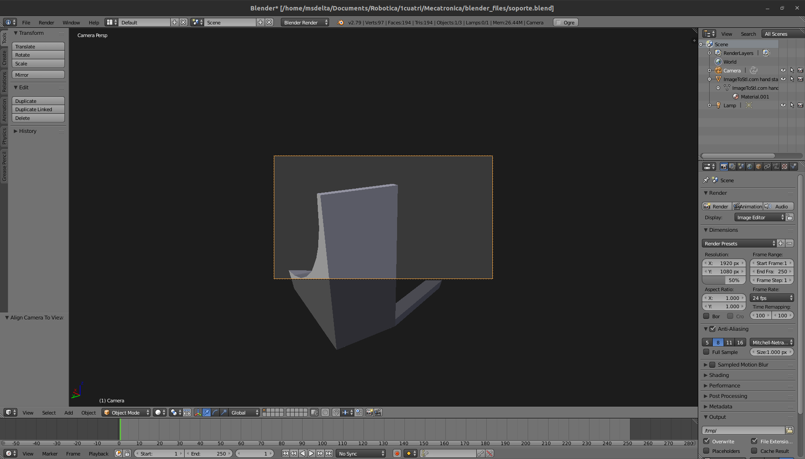
  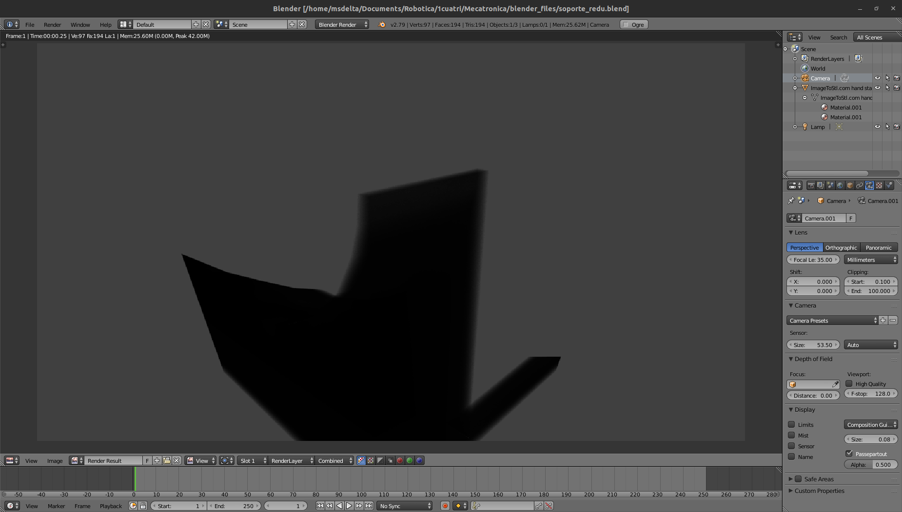

Por otro lado, también queda a continnuación el fichero final logrado en formato .stl también para su libre utilización y modificación:

- [Soporte_redu_stl](./models/soporte_redu.stl)

### Vistas y medidas del soporte

Partiendo del modelo stl logrado finalmente, usamos FreeCad para tomar ciertas medidas del mismo y corroborar su validez, así como para sacar ciertos planos y vistas del mismo.

Dado que el modelo no es simétrico, y tiene algunas irregularidades, por tener que adaptarse necesariamente al antebrazo de la Mano de Zeus, hay ciertas medidas que resultan poco intuitivas y puede creerse que son erróneas, pero si comprobamos todas las vistas y nos fijamos en la orientación de las caras laterales, podemos ver que realmente las medidas son las correctas. 

  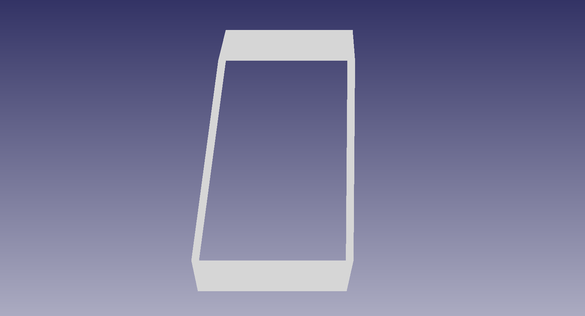
  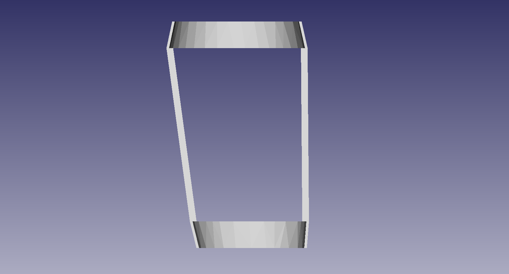

  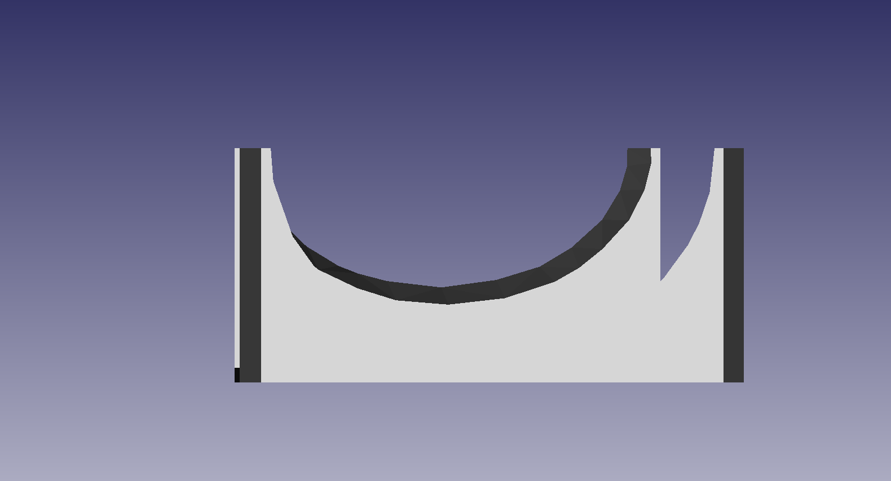
  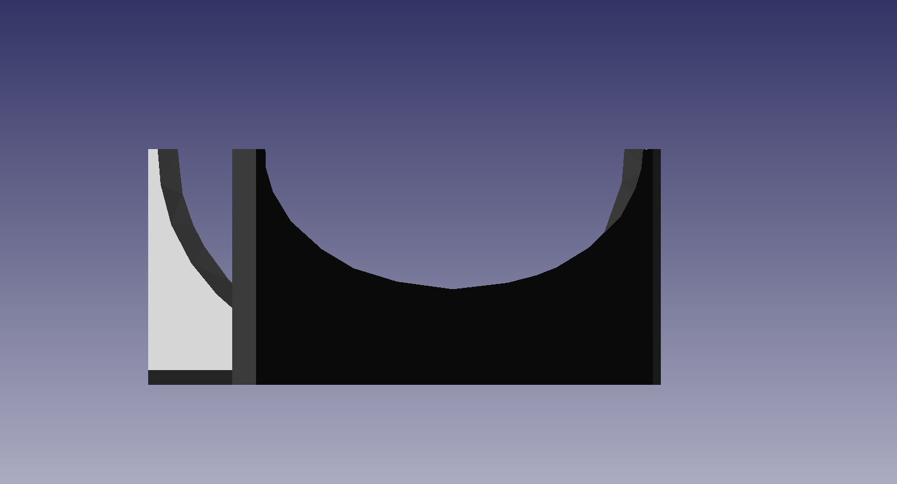

Las dos imágenes superiores muestran la vista desde la parte inferior y superior (bottom y top) respectivamente de izquierda a derecha, y en igual orden podemos ver las vistas desde la parte trasera y delantera (rear y front) en las imágenes inferiores.

Si comparamos y observamos detenidamente la orientación de los canales laterales que unen los dos arcos sobre los que se apoya finalmente el antebrazo, podemos ver que la pieza carece de simetría, y unido esto a que en las vistas superior e inferior observamos los laterales en detalle, viéndose que no conforman rectas perfectas, facilita la posterior comprensión de las medidas tomadas y las leves irregularidades que parecen presentar en un comienzo.

### Mediciones laterales

Adicionalmente a lo anterior, dejamos a continuación dos imágenes con las medidas que más dificultad de comprensión pueden tener, las laterales. Estas medidas fueron tomadas de forma persistente usando la función de regla en FreeCad, y pueden servir como idea previa a la visualización de los planos completos finales de la pieza, para hacerse una idea del tamaño y verificar sus dimensiones:

  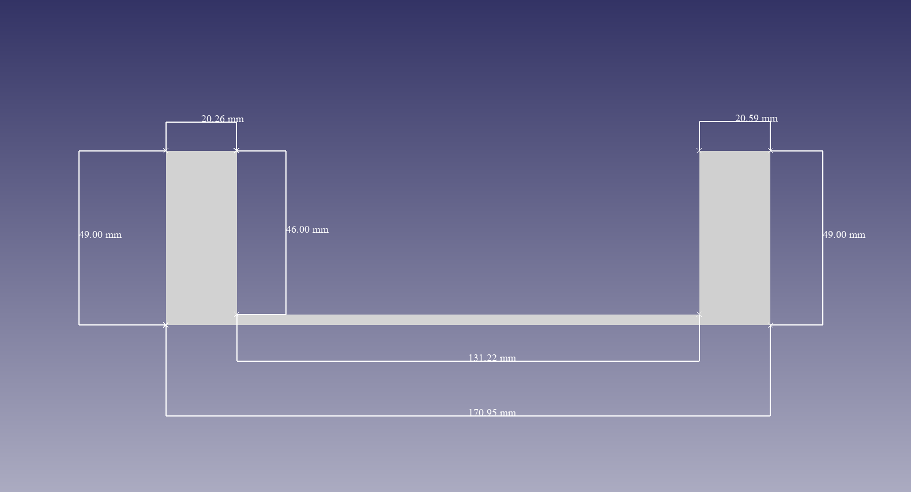
  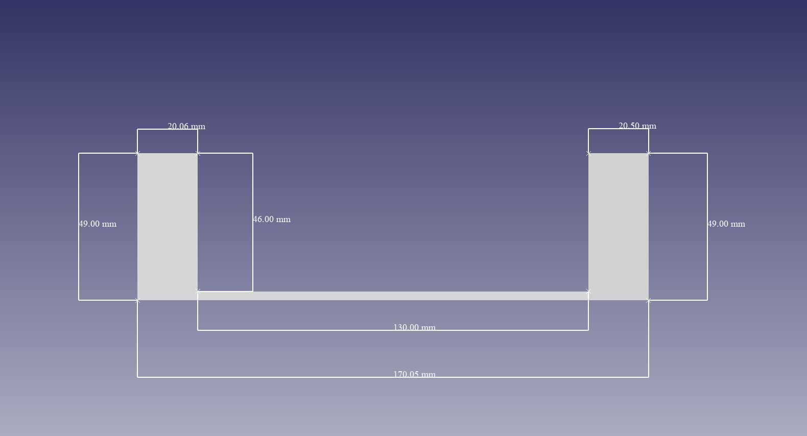

La imagen izquierda muestra una vista tomada del lado izquierdo del soporte, con las medidas de sus caras más relevantes indicadas en la propia imagen. De igual manera, la imagen derecha muestra la misma información pero relativa a la vista lateral derecha del modelo. 

Y como un extra más a estas imágenes podemos ver una perspectiva diferente que muestra las medidas de ambos lados en una visualización unificada. La imagen inferior está orientada de manera evidencial a las medidas, correspondiendo aquellas en el lado derecho de la imagen con las medidas del lateral derecho:

  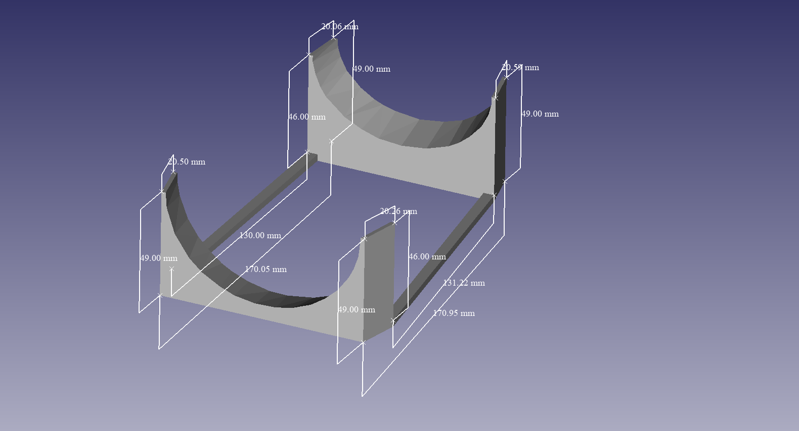

También queda a continuación el proyecto de FreeCad que hemos empleado para estas mediciones rápidas y explicación de las mismas:

- [Soporte_redu_fcstd](./models/soporte_redu.FCStd)

 

## Código de la Mano de Zeus

El código de la mano esta desarrollado en tres lenguajes, en C++, en Arduino y en Python. 

### Instalación 

Para que funcione correctamente el programa es necesario instalar previamente algunas librerías, a parte de los lenguajes usados.

Librerías utilizadas:

| Librerías | Comando de terminal  | Utilidad
|:------------- |:---------------:| :---------------|
| numpy         | pip install numpy | crear y usar vectores
| tkinter       | pip install tkinter | crear una interfaz interactiva
| mediapipe     | pip install mediapipe | detectar cuerpos, brazos y manos
| pillow        | pip install pillow | procesar imagenes |

En cuanto al desarrollo del código de la mano, lo hemos dividido en varias partes:

### Movimiento

La primera de las partes es el movimiento de la mano. En esta, solo nos centramos en producir el movimiento de los dedos y la muñeca a partir del uso de servomotores. Esta parte está programada en Arduino y C++.

Para comenzar, intentamos entender cómo funcionaban nuestros servos. Estos se mueven al recibir un valor de 0 a 180, los cuales simbolizan velocidades. El valor 90 representa velocidad nula; por encima de este, el servo gira en sentido antihorario, y por debajo, en sentido horario.

Para probar el correcto funcionamiento de los servos, utilizamos un código simple que se encarga de girar los servos en ambos sentidos, de forma intercalada.

~~~
#include <Servo.h>

Servo myservo; 
int currentPos = 0;
int targetPos = 90;
int speedLeft = 80;
int speedRight = 100;
int stopSpeed = 90;

void setup() {
  myservo.attach(3);
  myservo.write(stopSpeed);
  delay(1000);
}

void loop() {
  targetPos = 180; 
  moveServoTo(targetPos);  
  
  targetPos = 0;
  moveServoTo(targetPos);
}

void moveServoTo(int targetPos) {
  if (targetPos > currentPos) {
    myservo.write(speedRight); 
  } else if (targetPos < currentPos) {
    myservo.write(speedLeft);
  }
  delay(2000);
  myservo.write(stopSpeed); 
  currentPos = targetPos;
}
~~~

Después creamos un código que mueve los servos por ángulos, estimando el tiempo que tarda en moverse de un ángulo a otro. A este código solo se le debe pasar el ángulo al cual se quiere ir, y moverá el servo lo necesario para llegar a esa posición. 

El código completo está en los documentos [ServoM.cpp](./src/ServoM/ServoM.cpp) y [ServoM.h](./src/ServoM/ServoM.h).

### Comunicación

Tras desarrollar el código de movimiento de los servos, nos preguntamos cuál es la mejor manera de comandar los movimientos. Para ello se nos ocurrieron diferentes ideas.

La primera fue usar una ESP32 y comunicarnos con ella a través de WiFi desde el ordenador. No obstante, esta idea la descartamos para los primeros pasos, ya que, aparte de no contar con una ESP32, no queríamos complicar más el código con una comunicación muy compleja. Además, conseguir la reactividad deseada nos costaría bastante. Sin embargo, el uso de una ESP32 y WiFi es una idea a desarrollar para el prototipo final.

La segunda fue el uso de la comunicación serial. Esta es la que hemos decidido usar, ya que es bastante sencilla de programar y nos da una reactividad muy elevada. Como único inconveniente, el Arduino debe estar conectado al ordenador; aunque, de momento, al tener el Arduino accesible, no es un problema.

Nuestra comunicación está programada en Arduino y es el programa que se encarga de recibir los ángulos de la parte de detección y pasárselos a la parte de movimiento. 

El código completo está en el documento [ServoM.ino](./src/ServoM/ServoM.ino)

### Detección

Después de conseguir un buen funcionamiento del movimiento de los servos y de la comunicación, nos planteamos de qué manera íbamos a detectar y elegir cuáles eran los ángulos que les pasaríamos a los servos. 

La primera idea que se nos ocurrió fue escribir los ángulos por teclado, la opción más simple, pero un poco lenta, ya que debíamos escribir los ángulos a mano constantemente y para cada servo. Por lo tanto, la descartamos de inmediato.

La siguiente idea fue, en lugar de escribirlos, desarrollar unos controles deslizantes para todos los servos y enviar el valor correspondiente. Este era un método sencillo y más rápido. No obstante, aunque no era lo suficientemente cómodo y rápido para el objetivo del proyecto, lo dejamos como una opción para pruebas, en un modo aparte.

  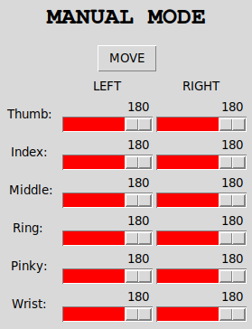

Finalmente, después de pensarlo mucho, se nos ocurrió, a partir de una asignatura que cursamos llamada Visión Artificial, utilizar una cámara para obtener una imagen de nuestros brazos y, a partir de esa imagen, calcular los ángulos de los dedos. Esto nos permitía una detección constante y rápida. El único inconveniente era que era más complejo de desarrollar, aunque finalmente lo conseguimos.

  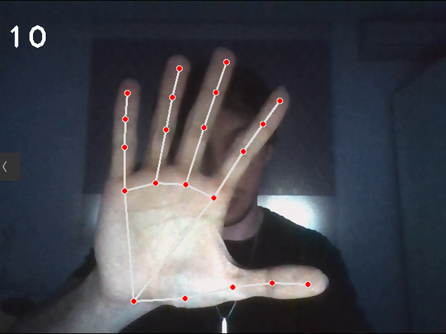
  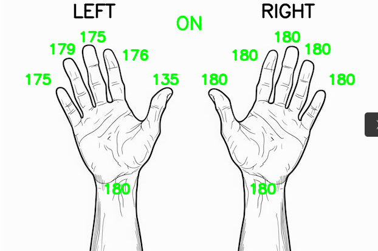

La detección completa está programada en Python y se ejecuta desde el ordenador o dispositivo, al cual está conectado el Arduino por conexión Serial.

El código completo está en el documento [mano_zeus.py](./src/handTracking/mano_zeus.py)

### Interfaz

Para terminar, se nos ocurrio desarrollar una simple interfaz desde la cual el usuario pueda interactuar con el programa para así elegir que modo quiere y que parametros quiere que se muestren, mientras que este puede observar la detección en tiempo real y los angulos que se pasan al Arduino.

Esta parte también esta desarrollada en Python y esta es una imagen de la interfaz desarrollada:

  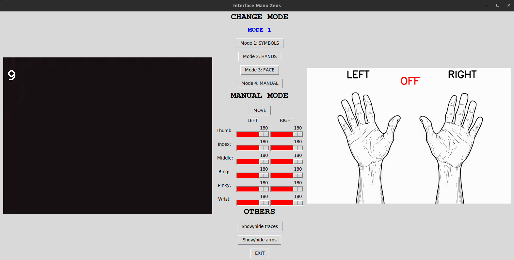

El código completo está en el documento [mano_zeus.py](./src/handTracking/mano_zeus.py)
