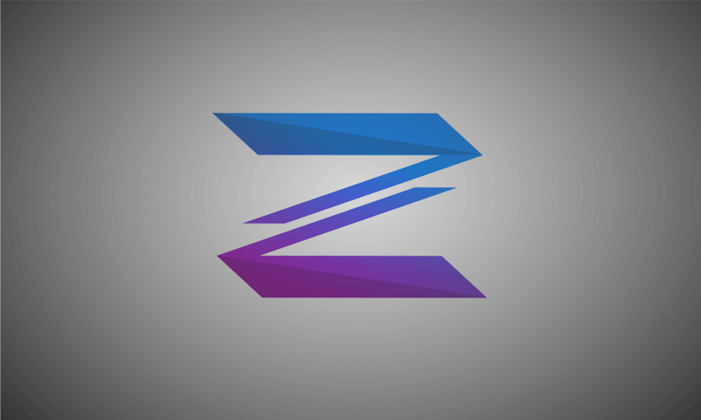
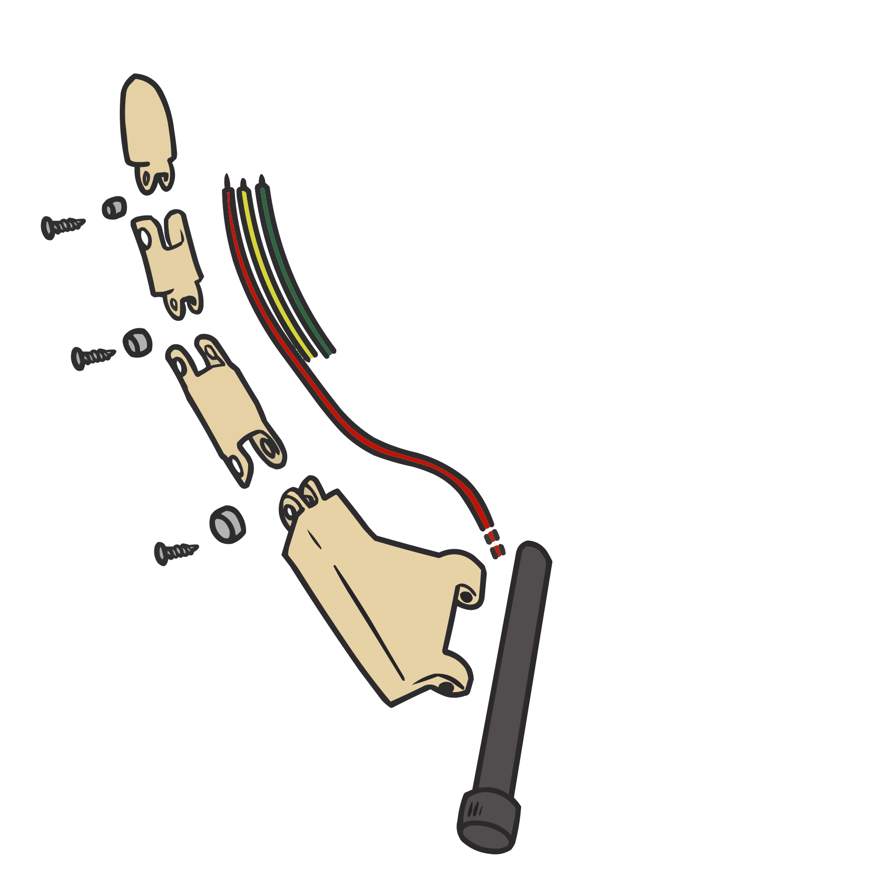

<!-- Improved compatibility of back to top link: See: https://github.com/othneildrew/Best-README-Template/pull/73 -->

<!--
*** Thanks for checking out the Best-README-Template. If you have a suggestion
*** that would make this better, please fork the repo and create a pull request
*** or simply open an issue with the tag "enhancement".
*** Don't forget to give the project a star!
*** Thanks again! Now go create something AMAZING! :D
-->

<!-- PROJECT SHIELDS -->
<!--
*** I'm using markdown "reference style" links for readability.
*** Reference links are enclosed in brackets [ ] instead of parentheses ( ).
*** See the bottom of this document for the declaration of the reference variables
*** for contributors-url, forks-url, etc. This is an optional, concise syntax you may use.
*** https://www.markdownguide.org/basic-syntax/#reference-style-links
-->

# Mecatronica-Proyecto
<!-- [![Contributors][contributors-shield]][contributors-url]
[![Forks][forks-shield]][forks-url]
[![Stargazers][stars-shield]][stars-url]
[![Issues][issues-shield]][issues-url]
[![MIT License][license-shield]][license-url]
[![LinkedIn][linkedin-shield]][linkedin-url]

 -->

<!-- PROJECT LOGO -->
 

  

  <h3 align="center">Proyecto-Zeus.</h3>

  

     
    <a href="https://github.com/RoboTech-URJC/Mano-Zeus.git"><strong>Original Robotech Repo »</strong></a>
     
     
    <a href="https://github.com/othneildrew/Best-README-Template">View Demo</a>
    ·
    <a href="https://github.com/othneildrew/Best-README-Template/issues/new?labels=bug&template=bug-report---.md">Personal Blog</a>
  

## Sesiones 3-4-5 | Diseño 2D.

En estas sesiones nos centramos en el diseño 2D. He aplicado los conocimientos en clase para diseñar un pequeño logo que decore el proyecto.
Requisitos:
* Inkscape.
* Creatividad.

  

A continuacion os dejo un pequeño video de como Marvin ha hecho este pequeño logo sobre el proyecto: 

https://github.com/user-attachments/assets/d4b07c5d-308e-4ce0-a138-df33238a739b

Empleando Inkspace he desarrollado un dibujo de la estructura que debe de tener la mano robótica que vamos a recrear. Es un diseño simple a modo de entendimiento de las diferentes partes que la componen. 

Este es el diseño que hemos obtenido:

  

(<a href="#readme-top">inicio</a>)

En materia del diseño vectorial, también es posible compatibilizarlo con otras técnicas, y para aplicarlo también al proyecto desde otra perspectiva, se me ha ocurrido investigar conversores de gráficos. Existen numerosos convertidores online gratuitos y algunos otros de pago que mejoran los resultados, y esto facilita que ciertas imágenes o diseños puedan ser vectorizados con herramientas también distintas a Inkscape y que no están pensadas en un principio para el diseño vectorial.

Aplicando estas herramientas a nuestro proyecto, Moisés ha diseñado un dibujo simple de algunos componentes de la mano, que también puede servir de apoyo a diagramas explicativos o información que se quiera enseñar y explicar del proyecto:

  
  

De las dos imágenes superiores, la izquierda pertenece a un formato en .png, siendo el fichero de dibujo original. Por otra parte la imagen derecha es el resultado de pasar la anterior por un conversor a svg (formato vectorial). El utlizado en este caso ha sido:
- https://png2svg.com/es/

Dejo a continuación un vídeo del proceso de diseño original de la imagen superior, en un programa de diseño no vectorial:

## Sesiones 6-7-8-9 | Diseño 3D.

En cuanto al diseño en 3D que hemos implementado en FreeCad ha sido una estructura simple del ejemplo de dibujo en 2D de Inkspace, obteniendo una estructuracompuesta por rectangulos similar a una mano, pero bastante simplificada. Mostrando en ella todos las piezas en las que tenemos pensado estructurarla.

La estructura se encuentra en el siguiente link: 

En cuanto al resto de diseño 3D hemos utilizado Ultimaker Cura para diseñar las piezas basandonos en el proyecto original del cual hemos sacado la idea. Hemos modificado los archivos (.lts) de los componentes aportando diferentes valores para obtener la mejor impresión de las piezas en nuestras impresoras 3D.

---

# Montaje de la Mano de Zeus

## 1. Componentes:

Teniendo el diseño 3d de las piezas, ajustamos adecuadamente los tamaños y utilizamos una impresora 3d para imprimir cada una. En total para la mano derecha desarrollada fueron utilizadas las siguientes partes:
- **Dedo meñique:** conformado por 6 piezas, ensambladas posteriormente entre sí. Adaptado del modelo original: [auriculaire-finger](https://inmoov.fr/inmoov-stl-3d/?bodyparts=Right-Hand&parts=Auriculaire3.stl)
- **Dedo anular:** conformado por 6 piezas, ensambladas posteriormente entre sí. Adaptado del modelo original: [ring-finger](https://inmoov.fr/inmoov-stl-3d/?bodyparts=Right-Hand&parts=ringfinger3.stl)
- **Dedo corazón:** conformado por 6 piezas, ensambladas posteriormente entre sí. Adaptado del modelo original: [majeure-finger](https://inmoov.fr/inmoov-stl-3d/?bodyparts=Right-Hand&parts=Majeure3.stl)
- **Dedo índice:** conformado por 6 piezas, ensambladas posteriormente entre sí. Adaptado del modelo original: [index-finger](https://inmoov.fr/inmoov-stl-3d/?bodyparts=Right-Hand&parts=Index3.stl)
- **Dedo pulgar:** conformado por 6 piezas, ensambladas posteriormente entre sí. Adaptado del modelo original: [thumb-finger](https://inmoov.fr/inmoov-stl-3d/?bodyparts=Right-Hand&parts=thumb5.stl)

  

- **Espaciador:** soporte estructural para ensamblar los dedos meñique y anular con la muñeca corta. Adaptado del modelo original: [bolt-entretoise](https://inmoov.fr/inmoov-stl-3d/?bodyparts=Right-Hand&parts=Bolt_entretoise7.stl)
- **Muñeca larga:** pieza única, ensamblada para conformar el mecanismo del movimiento transferido de muñeca a los dedos, junto con la Muñeca corta. Adaptado del modelo original: [wrist-large](https://inmoov.fr/inmoov-stl-3d/?bodyparts=Right-Hand&parts=WristlargeV4.stl)
- **Muñeca corta:** dos piezas, ensambladas al dedo anular y meñique, uniéndolos a la Muñeca larga para conformar el movimiento transferido por la muñeca a los dedos mencionados. Adaptado del modelo original: [wrist-small](https://inmoov.fr/inmoov-stl-3d/?bodyparts=Right-Hand&parts=WristsmallV4.stl)

  

- **CableHolderWristV5:** elemento de apoyo para facilitar la incorporación del cableado que conecta con muñeca y mano. Adaptado del modelo original: [cable-holder](https://inmoov.fr/inmoov-stl-3d/?bodyparts=Rotation-Wrist&parts=CableHolderWristV5.stl)
- **RotaWrist 3V3:** pieza única relacionada con el módulo de la muñeca. Adaptado del modelo original: [rotawrist3v3](https://inmoov.fr/inmoov-stl-3d/?bodyparts=Rotation-Wrist&parts=RotaWrist3V3.stl)
- **RotaWrist 2V3:** primera de las piezas que conforman la cobertura posterior del módulo de la muñeca. Adaptado del modelo original: [rotawrist2v3](https://inmoov.fr/inmoov-stl-3d/?bodyparts=Rotation-Wrist&parts=RotaWrist2V3.stl)
- **RotaWrist 1V4:** segunda de las piezas que conforman la cobertura posterior del módulo de la muñeca. Adaptado del modelo original: [rotawrist1v4](https://inmoov.fr/inmoov-stl-3d/?bodyparts=Rotation-Wrist&parts=RotaWrist1V4.stl)
- **WristgearsV5:** engranajes necesarios para la rotación del módulo de la muñeca. Adaptado del modelo original: [wrist-gears](https://inmoov.fr/inmoov-stl-3d/?bodyparts=Rotation-Wrist&parts=WristGearsV5.stl)
- **RobocableBackV3:** pieza de apoyo para la integración del cableado, junto con rob-cable-front. Adaptado del modelo original: [rob-cable-back](https://inmoov.fr/inmoov-stl-3d/?bodyparts=Forearm-and-Servo-Bed&parts=RobCableBackV3.stl)
- **RobocableFrontV3v:** segunda pieza de apoyo para la integración del cableado con la rotación de muñeca. Adaptado del modelo original: [rob-cable-front](https://inmoov.fr/inmoov-stl-3d/?bodyparts=Forearm-and-Servo-Bed&parts=RobCableFrontV3.stl)
- **RoboRingV3:** anillos ensamblados a los servomotores, necesarios para implementar el movimiento de los dedos. Adaptado del modelo original: [rob-ring](https://inmoov.fr/inmoov-stl-3d/?bodyparts=Forearm-and-Servo-Bed&parts=RobRingV3.stl&doing_wp_cron=1732996341.5229659080505371093750)
- **RobServoBedV6:** pieza única empleada para situar correctamente la posición interna de los servomotores. Adaptado del modelo original: [servo-bed](https://inmoov.fr/inmoov-stl-3d/?bodyparts=Forearm-and-Servo-Bed&parts=RobServoBedV6.stl)
- **TensionerRightV1:** pieza de apoyo al ensamblaje de los componentes internos. Adaptado del modelo original: [tensioner-right](https://inmoov.fr/inmoov-stl-3d/?bodyparts=Forearm-and-Servo-Bed&parts=TensionerRightV1.stl)
- **Servo-pulley:** poleas circulares, transforman el movimiento de los servomotores. Adaptado del modelo original: [servo-pulley](https://inmoov.fr/inmoov-stl-3d/?bodyparts=Forearm-and-Servo-Bed&parts=servo-pulleyX5.stl)

  
  

- **Cubierta superior (tumbada):** similar a las piezas que cubren los dedos, siendo esta una cobertura para la parte superior de la mano. Adaptado del modelo original: [top-surface](https://inmoov.fr/inmoov-stl-3d/?bodyparts=Right-Hand&parts=topsurfaceUP6.stl&doing_wp_cron=1732995560.7582659721374511718750)
- **Cubrededos:** conformado por 5 piezas, ensambladas sobre los dedos. Adaptado del modelo original: [cover-finger](https://inmoov.fr/inmoov-stl-3d/?bodyparts=Right-Hand&parts=coverfinger1.stl)
- **Soporte Arduino:** pieza única para contener la placa Arduino controladora. Adaptado del modelo original: [arduino-support](https://inmoov.fr/inmoov-stl-3d/?bodyparts=Right-Hand&parts=ardiuinosupport.stl)
- **Robcap3V2:** uno de los componentes que conforman el antebrazo, siendo la cubierta superior del mismo. Adaptado del modelo original: [robcap3v2](https://inmoov.fr/inmoov-stl-3d/?bodyparts=Right-Hand&parts=robcap3V2.stl)
- **Robcap2V4:** primera cubierta anterior del antebrazo. Adaptado del modelo original: [robcap2v4](https://inmoov.fr/inmoov-stl-3d/?bodyparts=Right-Hand&parts=robpart2V4.stl)
- **Robcap3V4:** segunda cubiera anterior del antebrazo. Adaptado del modelo original: [robcap3v4](https://inmoov.fr/inmoov-stl-3d/?bodyparts=Right-Hand&parts=robpart3V4.stl)
- **Robcap4V4:** primera cubierata posterior del antebrazo. Adaptado del modelo original: [robcap4v4](https://inmoov.fr/inmoov-stl-3d/?bodyparts=Right-Hand&parts=robpart4V4.stl)
- **Robcap5V4:** segunda cubierta posterior del antebrazo. Adaptado del modelo original: [robcap5v4](https://inmoov.fr/inmoov-stl-3d/?bodyparts=Right-Hand&parts=robpart5V4.stl)

  

